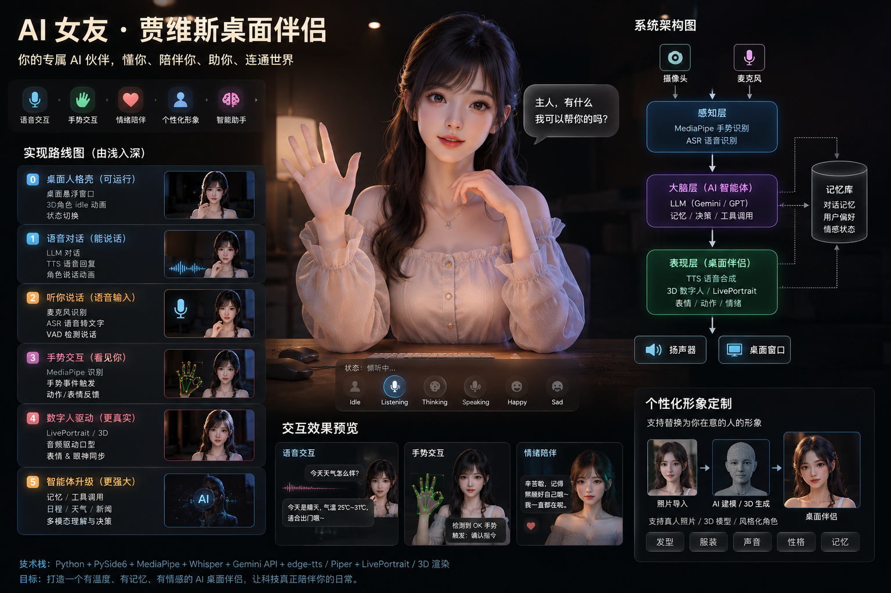

# Vision Reference

## 北极星愿景图

本项目以北极星愿景图为整体目标指导图。

---

## 愿景图定位

愿景图是：

- **产品愿景参考** — 长期目标和方向
- **目标体验参考** — 希望达到的用户体验
- **路线图方向参考** — 版本规划的指引
- **产品气质参考** — 整体风格和调性

愿景图不是：

- ❌ 技术规格书
- ❌ 第一阶段验收标准
- ❌ 必须完全复刻的 UI 图
- ❌ 立即要实现的功能清单

---

## 核心目标

从愿景图中提炼的核心目标：

1. **桌面 AI 伙伴** — 在桌面上运行的 AI 陪伴实体
2. **多模态交互** — 支持语音、视觉、手势等多种交互方式
3. **Jarvis 式助手体验** — 智能、主动、个性化的助手体验
4. **情绪陪伴价值** — 情感支持和陪伴能力
5. **个性化形象 / 可替换形象** — 用户可定制的外观和形象

---

## 技术模块

从愿景图中提炼的技术模块：

| 模块 | 描述 |
|------|------|
| **UI 层** | 界面展示、渲染和用户交互 |
| **Core 层** | EventBus、StateMachine、Config、生命周期 |
| **Brain 层** | AI 推理、决策和语言处理 |
| **Expression 层** | 表情、动作和表达输出 |
| **Perception 层** | 感知输入处理（语音、手势等） |
| **Memory 层** | 记忆存储（长期/短期） |
| **Tool 层** | 工具路由和 Agent 能力 |

---

## 阶段规划映射

愿景图到版本路线图的映射关系：

| 版本 | 阶段 | 说明 |
|------|------|------|
| **V0** | 文档治理与项目规则 | 项目规范和文档体系建立 |
| **V1** | 工程初始化与桌面壳 | PySide6 最小可运行壳 |
| **V2** | 状态机与事件总线 | 核心基础设施 |
| **V3** | 文本对话与 TTS | 基础对话能力 |
| **V4** | 语音输入 ASR | 语音交互 |
| **V5** | 手势事件 | 手势识别交互 |
| **V6** | Avatar 表现增强 | 数字人表现力 |
| **V7** | Agent 工具能力 | 自主 Agent |
| **V8** | 记忆与人格系统 | 长期陪伴能力 |

---

## 项目定位

Desktop Girlfriend 是一个桌面 AI 伙伴**原型项目**，目标是探索：

- 桌面人格表现
- 语音交互
- 手势交互
- 多模态感知
- 情绪陪伴
- MiniMax AI 能力集成

**它不是**：单纯聊天机器人、单纯桌宠、或第一阶段就要实现完整 3D AI 女友。

**更准确的长期方向**：桌面人格壳 + Jarvis 式助手 + 情绪陪伴 + 多模态交互实验平台。

---

## 关联文档

- [项目简介](./PROJECT_BRIEF.md)
- [路线图](./ROADMAP.md)
- [架构规范](./ARCHITECTURE.md)
